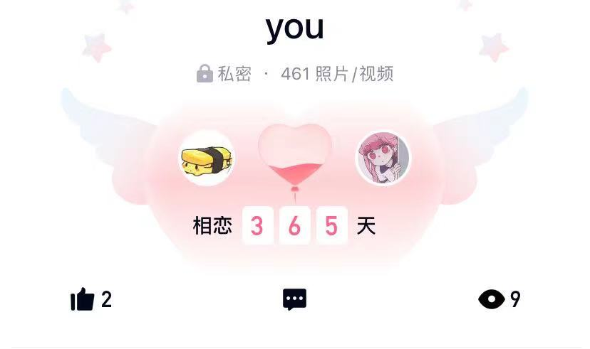

## Hey
>遇到你，是一生的幸运

12月08日，我和yuyu在一起的纪念日，也是我们一年的里程碑。

回想起去年的今天，我人生中第二次旷课就被抓了，就是那次还剩下二十分钟就下课的物理老师开始点名。

虽然那一学期的全勤分没了，但我不后悔，因为收获了❤。

记着当时的我只和yuyu线下见过两次面，但我在线上直觉感受到这是适合我的女孩。

那天中午，是我第一次正式请女生吃饭和送礼物，也是我第一次把多日爱慕的话写送给女生。

太多的第一次，太多的不知所措，多么的想通过每次字词精准的表达出我的内心，这在一开始给她留下了说话语速比较慢，比较呆的印象。

一个小县半水桶做题家，孤身步入大学的懵懂少年，在遇到你之后才开始像大人们感受生活

和你一起去繁华市中心感受商业美食，和你一起去城中小街感受人间烟火，和你一起去珠江海口感受闲情微风......

虽然我们会经常黏在一起，但并没有影响对方的生活，直接的影响就是让我改变了打游戏的习惯。

在她的熏染下，我也开始感知一些生活气息的推文，说说和视频，虽然偶然内容易在网上引起大多数人争论，但我们也总能观点一致。

我们互相认知对方的朋友圈，真实的把自己展示给对方.......

是的，一年的相处，我确信这是对的人。

